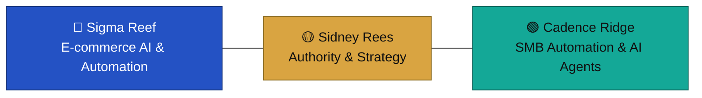

# 📋 The Fractional CTO / PMO Playbook for eCommerce Launches

## What Is This?

This is the execution methodology I use as a Fractional CTO/PMO to take eCommerce projects from fuzzy idea to successful launch — the same structure behind the case studies in [`real-cases-and-success-stories`](https://github.com/sidneyrees/real-cases-and-success-stories).

## Playbook Structure

| Section | Status |
|---|---|
| 1. [Project Charter Template](./01-project-charter.md) | ✅ Available |
| 2. [Risk Matrix for eCommerce](./02-risk-matrix.md) | ✅ Available |
| 3. [Weekly Status Report](./03-weekly-status-report.md) | ✅ Available |
| 4. [Launch Checklist (100+ points)](./04-launch-checklist.md) | ✅ Available |
| 5. [Post-Mortem Template](./05-post-mortem.md) | ✅ Available |

## How I Use This (Real Example)

Mid-size fashion brand migrating from WooCommerce to Shopify:

- Week 1: Project Charter + Risk Matrix → Identified inventory mapping as critical risk
- Weeks 2-4: Weekly Status Reports → Stakeholder never surprised
- Week 5: Launch Checklist → Zero downtime migration
- Week 6: Post-Mortem → 3 process improvements

## Want the Full Client Version?

The templates above are the public framework. I customize and run these live for clients — including the emergency-migration variant used in the [40K-product recovery case study](https://github.com/sidneyrees/real-cases-and-success-stories). Schedule a call: https://www.sidneyrees.com/contact

## Next Step

**→ [See this framework applied in real client work](https://github.com/sidneyrees/real-cases-and-success-stories)**

More resources

- Tech Radar → https://github.com/sidneyrees/ecommerce-tech-radar
- Automation & AI Agents for eCommerce → https://github.com/sidneyrees/automation-agents-for-ecommerce
- Project Recovery Kit → https://github.com/sidneyrees/project-recovery-kit

---

🔵 [Sigma Reef](https://sigmareef.com) · 🟡 [Sidney Rees](https://sidneyrees.com) · 🟢 [Cadence Ridge](https://cadenceridge.com)

---

## I can help. Let's talk.

Sidney Rees — Fractional CTO+PMO for eCommerce & Digital Businesses

🌐 https://www.sidneyrees.com

📫 Available for consulting opportunities
